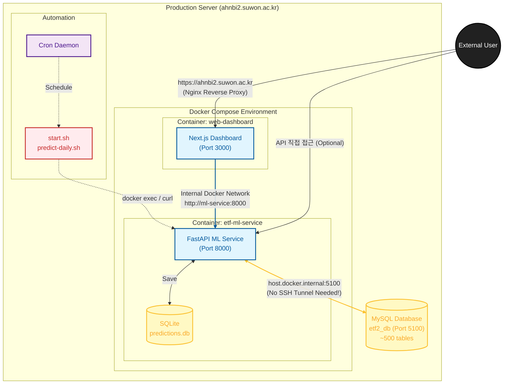

# AI ETF Project

AI 기반 미래 수익률 예측으로 패시브 ETF를 능가하는 Active ETF 운용 시스템.

## 핵심 개념 요약

### 문제 인식
- 패시브 ETF(QQQ 등)는 과거 시가총액에 의존 → 상위 종목 적중률 약 6%
- 운용자 재량 기반 액티브 ETF는 불투명하고 일관성 부족

### 솔루션: AI Daily Rolling ETF
- **AI 예측**: 트랜스포머 모델로 3개월 후 수익률 상위 종목 예측 (적중률 24%+)
- **Daily Rolling 구조**: 매일 포트폴리오 1%를 FIFO로 교체
- **규제 대응**: 상관계수 0.7 기준 모니터링, 경계 근접 시 추종지수 매수로 전환

### 경쟁 우위
| 항목 | 패시브 ETF | 기존 액티브 | 우리 모델 |
|------|-----------|------------|----------|
| 투자 기준 | 과거 시가총액 | 운용역 재량 | 미래 수익률 예측 |
| 종목 교체 | 분기/반기 | 수시 | 매일 1% FIFO |
| 적중률 | ~6% | 변동 | 24%+ |
| 투명성 | O | X | O (웹 공개) |

### 비즈니스 모델
1. **운용 보수**: 직접 ETF 운용 (0.05% 기준)
2. **기술 라이선싱**: AI 예측 엔진을 타 운용사에 B2B 제공

### 규제 환경
- 국내: 비교지수 상관계수 0.7 이상 유지 필수
- 미국: 2019년 규제 완화 후 Active ETF 폭발 성장 (J커브)
- 전략: 규제 준수하며 알파 추구, 향후 완화 대비

## 상세 참조

비즈니스 플랜 전문: [references/business-plan.md](references/business-plan.md)

포함 내용:
- 시장 현황 및 성장성 분석
- 단계별 사업화 추진 전략 (Step 1~7)
- 기술적/사업적 준비 현황
- 수익 모델 상세 (AUM 시나리오)
- 팀 구성 및 투자 유치 전략

## 기술 스택 연결

이 프로젝트의 기술 구현:
- **ML 서비스**: `ml-service/` - FastAPI 기반 예측 API
- **스크래핑**: `data-scraping/` - 1일,1주,1달,12달 주가 데이터 수집
- **웹 상품소개/대시보드**: `web-dashboard/` - Next.js 상품소개 및 포트폴리오 시각화
- **모델 실험**: `etf-model/` - 예측 모델 학습/평가
- **자동화 모니터링**: `auto-monitoring/` - Next.js 자동화 진행여부 모니터링

설정될 작업:
1. **매일 오전 8시**: 데이터 크롤링
2. **매월 1일 새벽 3시**: 모델 학습
3. **스크래핑이 끝난 직후 ~ 장이 시작하기 전까지**: 다음날 매매/매도 종목 예측

## 주요 용어

| 용어 | 설명 |
|------|------|
| Daily Rolling | 매일 포트폴리오 일부를 교체하는 운용 방식 |
| FIFO | 선입선출, 가장 오래된 매수 블록부터 매도 |
| 코호트 | 같은 날 편입된 종목 그룹 |
| 상관계수 0.7 | 국내 액티브 ETF 규제 기준 |
| 알파 | 벤치마크 대비 초과 수익 |
