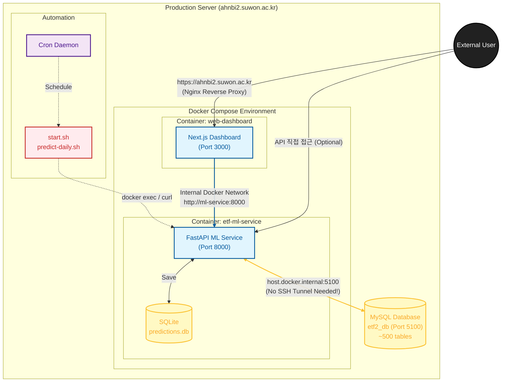

# CLAUDE.md - ETF Trading Pipeline Project

## Project Overview
ETF 주식 데이터 분석 및 예측을 위한 데이터 파이프라인 시스템. FastAPI 기반 ML 서비스가 Docker에서 실행되며, SSH 터널을 통해 원격 MySQL 데이터베이스에 접근합니다. Next.js 기반 웹 대시보드로 예측 결과와 포트폴리오를 시각화합니다.

## Architecture


## Build & Run Commands

### 전체 서비스 시작
```bash
./start.sh              # SSH 터널 + Docker 서비스 시작
cd web-dashboard && npm run dev  # 웹 대시보드 시작
```

### 서비스 중지
```bash
./stop.sh               # Docker 서비스 중지 (SSH 터널 유지)
```

### 상태 확인
```bash
./status.sh             # 서비스 상태 및 API 헬스체크
```

### Docker 직접 제어
```bash
docker-compose up -d    # 컨테이너 시작
docker-compose down     # 컨테이너 중지
docker-compose logs -f  # 로그 확인
docker-compose build    # 이미지 재빌드
```

### SSH 터널 수동 시작
```bash
ssh -f -N -L 3306:127.0.0.1:5100 ahnbi2@ahnbi2.suwon.ac.kr
```

### 웹 대시보드
```bash
cd web-dashboard
npm run dev             # 개발 서버 (http://localhost:3000)
npm run build           # 프로덕션 빌드
npm run start           # 프로덕션 서버
```

## API Endpoints

Base URL: `http://localhost:8000`

| Method | Endpoint | Description |
|--------|----------|-------------|
| GET | `/health` | 헬스체크 |
| GET | `/api/stocks` | 종목 목록 조회 |
| GET | `/api/stocks/{symbol}/history` | 종목 히스토리 조회 |
| POST | `/api/predictions/batch` | 전체 종목 일괄 예측 |
| POST | `/api/predictions/{symbol}` | 단일 종목 예측 |
| GET | `/api/predictions` | 저장된 예측 결과 조회 |

### 예측 API 주의사항
- `/batch` 엔드포인트가 `/{symbol}` 보다 먼저 선언되어야 함 (경로 충돌 방지)
- 잘못된 순서시 "BATCH_D table not found" 에러 발생

## Web Dashboard

Base URL: `http://localhost:3000`

### 페이지 구성
| 경로 | 페이지 | 설명 |
|------|--------|------|
| `/` | 대시보드 | 포트폴리오 요약, 예측 시그널, 차트 |
| `/predictions` | 예측 결과 | RSI/MACD 기반 매매 신호 (API 연동) |
| `/portfolio` | 포트폴리오 | 보유 종목, 자산 배분 차트 |
| `/returns` | 수익률 분석 | 누적/일일 수익률, 종목별 기여도 |

### 기술 스택
- Next.js 16 + TypeScript
- shadcn/ui (Vega 스타일)
- Recharts (차트)
- Tailwind CSS

### 주요 파일
```
web-dashboard/
├── app/
│   ├── page.tsx              # 메인 대시보드
│   ├── predictions/page.tsx  # 예측 결과 (API 연동)
│   ├── portfolio/page.tsx    # 포트폴리오
│   └── returns/page.tsx      # 수익률 분석
├── components/
│   ├── app-sidebar.tsx       # 사이드바 네비게이션
│   └── ui/                   # shadcn 컴포넌트
├── lib/
│   ├── api.ts               # FastAPI 연동 함수
│   └── data.ts              # 더미 데이터 (포트폴리오, 수익률)
└── hooks/
    └── use-mobile.tsx       # 반응형 훅
```

## Database Configuration

### Remote MySQL (via SSH Tunnel)
- Host: `host.docker.internal:3306` (Docker 내부에서)
- Database: `etf2_db`
- ~500개 테이블 (AAPL_D, NVDA_1h 등)
- 컬럼: symbol, timeframe, time, open, high, low, close, volume, rsi, macd

### Local SQLite
- 경로: `ml-service/data/predictions.db`
- 용도: 예측 결과 저장

## Cron Automation

### 설정된 작업
1. **매일 오전 8시**: 전체 종목 예측 (`predict-daily.sh`)
2. **매월 1일 새벽 3시**: 모델 학습 (`train-monthly.sh`)

### Cron 설정 방법
```bash
./scripts/setup-cron.sh
```

### 로그 위치
- `logs/cron.log` - cron 실행 요약
- `logs/predict-YYYYMMDD.log` - 일일 예측 상세
- `logs/train-YYYYMM.log` - 월간 학습 상세

## Project Structure
```
etf-trading-project/
├── docker-compose.yml      # Docker 서비스 정의
├── start.sh               # 서비스 시작 스크립트
├── stop.sh                # 서비스 중지 스크립트
├── status.sh              # 상태 확인 스크립트
├── ml-service/
│   ├── Dockerfile
│   ├── requirements.txt
│   ├── data/              # SQLite DB 저장 위치
│   └── app/
│       ├── main.py        # FastAPI 진입점
│       ├── database.py    # DB 연결 설정
│       ├── models/        # SQLAlchemy 모델
│       ├── routers/       # API 라우터
│       └── services/      # 비즈니스 로직
├── web-dashboard/         # Next.js 웹 대시보드
│   ├── app/              # 페이지 컴포넌트
│   ├── components/       # UI 컴포넌트
│   ├── lib/              # API 연동, 데이터
│   └── hooks/            # React 훅
├── scripts/
│   ├── predict-daily.sh   # 일일 예측 스크립트
│   ├── train-monthly.sh   # 월간 학습 스크립트
│   └── setup-cron.sh      # cron 설정 스크립트
└── logs/                  # 실행 로그
```

## Key Implementation Notes

### SSH 터널 필수
- 원격 MySQL은 포트 5100에서 실행됨
- Docker 컨테이너는 `host.docker.internal`로 호스트의 터널에 접근

### PATH 설정 (cron 환경)
모든 스크립트 상단에 PATH 설정 필요:
```bash
export PATH="/usr/local/bin:/usr/bin:/bin:/opt/homebrew/bin:$PATH"
export PATH="/Applications/Docker.app/Contents/Resources/bin:$PATH"
```

### 예측 모델 (MVP)
- 단순 RSI/MACD 기반 규칙 모델
- RSI < 30 → 매수 신호, RSI > 70 → 매도 신호
- 향후 LSTM/Transformer 모델로 확장 예정

### 웹 대시보드 API 연동
- `lib/api.ts`에서 FastAPI 엔드포인트 호출
- 예측 결과 페이지: 실시간 API 데이터
- 포트폴리오/수익률: 더미 데이터 (추후 API 확장)

## Troubleshooting

### "docker: command not found" in cron
- 스크립트 상단에 PATH 설정 확인

### "BATCH_D table not found"
- `routers/predictions.py`에서 `/batch` 라우트가 `/{symbol}` 보다 먼저 선언되어 있는지 확인

### MySQL 연결 실패
- SSH 터널이 실행 중인지 확인: `pgrep -f "ssh.*3306"`
- 터널 재시작: `./start.sh`

### 웹 대시보드 API 연결 실패
- FastAPI 서비스 실행 확인: `curl http://localhost:8000/health`
- CORS 설정 확인 (FastAPI에서 localhost:3000 허용 필요)
